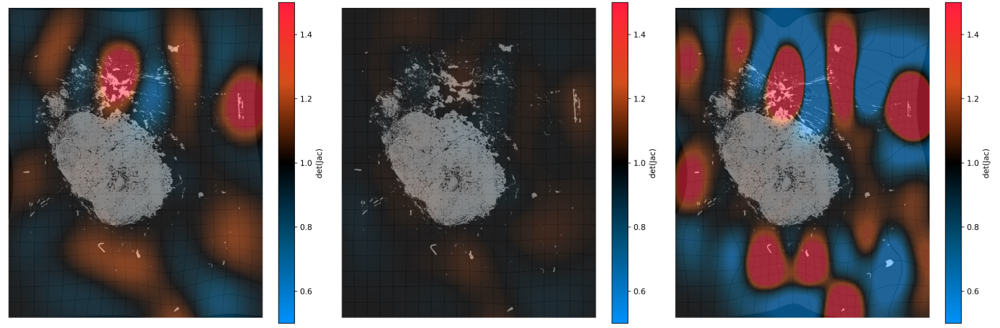

# IntegrAlign

A comprehensive tool for multi-immunofluorescence panel integration through image alignement

## Prerequisites

Ensure you have Python 3.9.13 installed on your system. You can download it from the [official Python website](https://www.python.org/downloads/).

## Installation

We recommend running IntegrAlign in a virtual environment to prevent conflicts with other packages or system dependencies. Here's how you can do it:

1. Install `virtualenv` package, if it's not already installed:

```bash
pip install virtualenv
```

2. Navigate to the directory where you want to create the virtual environment and run:

```bash
virtualenv IntegrAlign_env
```

3. To activate the virtual environment, use:
   
On Windows:

```bash
IntegrAlign_env\Scripts\activate
```

On Unix or MacOS:

```bash
source IntegrAlign_env/bin/activate
```

4. Navigate to the IntegrAlign directory (with setup.py). Then install the dependencies by running:

```bash
pip install .
```

## Quick start

### 0 Inputs

IntegrAlign requires three main types of files to align multi-IF slides:

<u>1. Scan Images</u>

- Recommended format: .qptiff

   - Use this format when

      - phenotyping has been performed in inForm,

      - or when phenotyping has been performed in HALO and unmixing was done directly using the Vectra Polaris scanner.

- Alternative format: .tif (HALO)

   - Use this when phenotyping was performed in HALO and unmixing was handled by inForm. The fine-tunning step will be suboptimal, as the image quality (for the mirrored cursor visualization) will be drastically reduced due to closed indica .tif format. Additionally, image loading time may take longer (bigger files than .qptiff for the same image size).

<u>2. Annotation Files</u>

- Supported formats: .annotations or .geojson

<u>3. Coordinate Tables</u>

- Format: .csv

- Requirements: The coordinates must be in the same coordinate system as the corresponding image. If any rotation or translation has been applied (e.g., in HALO), the coordinates may no longer match the image directly. As a result, the transformation will be applied on false coordinates resulting in errors in the final table.

   - Can include XMin, XMax, YMin, and YMax columns (pixel coordinates, e.g. HALO outputs).

   - Or x and y columns (coordinates in microns, e.g. inForm outputs).

- Important:
  
   - All files (images, annotations, and coordinate tables) must be placed in their corresponding panel folders.
   
   - Filenames must start with the patient ID, followed by an underscore (_).

Example folder structure:
```bash
DC/
├── 0001_pDC.annotations
├── 0001_pDC.qptiff
└── 0001_pDC.csv

TLS/
├── 0001_pTLS.annotations
├── 0001_pTLS.qptiff
└── 0001_pTLS.csv
```

   - Avoid raw HALO / Inform outputs with Intensity and Classication columns as **you cannot infer functional markers between aligned panel since cells aren't exactly the same between serial slides**. Instead chose the corresponding cell types to avoid double positive cells and preprocess the tables into final tables that should contain :
   
   - Avoid using raw HALO or Inform outputs that include Intensity and Classification columns, as functional marker interpretation between aligned panels is unreliable — cells don’t perfectly correspond across serial slides. Instead, select the appropriate cell types to prevent false double positives. Preprocess your tables into finalized versions containing at least one of the following coordinate formats:

      - XMin, XMax, YMin, YMax columns (pixel coordinates), or

      - x, y columns (pixel coordinates).

### 1 Visualization

Once you have activated your virtual environment and installed the necessary dependencies, you can run the first step of the tool by using:

```bash
python main_IntegrAlign.py visualize --scans "panel_T/SCANS/" "panel_DC/SCANS/" "panel_TLS/SCANS/" --annotations "T/Annotations/" "DC/Annotations/" "TLS/Annotations/" --panels T DC TLS --output "output/"
```

This steps will create a report file ```images_report.html``` that plots every panels for each patients. This will help identify which slides cannot be aligned, saving time when processing large patient cohorts.

<ins>Options:</ins>

--scans - 2 or 3 paths to the folders of each panel that contains the .qptiff files of every patients.

--annotations - Paths to 2 or 3 panel folders of the annotation files (.geojson). Optional.

To avoid mismatches and capture all corresponding annotation names across patients—even if they vary—this step displays every annotation name found in the provided annotation files. This allows you to easily identify and group all possible names for each category (AnalysisArea, Artefacts/ ManualArtefacts, EmptyArea).
Here is an example:

```python
Found the following unique annotation names:
1: Analysis_area_MI
2: Analysis_area_T
3: Analysis_area_Total
4: Artefacts_MI
5: Artefacts_T
6: Manual_artefacts_MI
7: Manual_artefacts_T
8: No_tissue_MI
9: No_tissue_T
10: Stroma_MI
11: Stroma_T
12: Tumor_MI
13: Tumor_T

Enter numbers (comma-separated) for 'AnalysisArea' annotations: 3
Enter numbers (comma-separated) for 'Artefacts' annotations: 4, 5, 6, 7
Enter numbers (comma-separated) for 'Empty' annotations: 8, 9

✅ Selected AnalysisArea names: ['Analysis_area_Total']
✅ Selected Artefacts names: ['Artefacts_MI', 'Artefacts_T', 'Manual_artefacts_MI', 'Manual_artefacts_T']
✅ Selected Empty names: ['No_tissue_MI', 'No_tissue_T']
```
  
</ins>Important:</ins> If you have multiple analysis areas (e.g., Tumor and Margin Invasion), the tool will compute the intersection of these areas after alignment across panels. Since annotations may not perfectly overlap between panels, this could lead to the exclusion of cells located at the boundaries between regions (often the most biologically relevant cells).
To prevent this, consider creating a unified (global) analysis area annnotation that encompasses all regions of interest to ensure no important cells are excluded.

--panels - Panel names.

--output - Path to the main output folder.

Notes : **The order is crucial** for --scans, --annotations and --panels options. It should be consistent at every step and the reference panel has to be in the middle for alignment of 3 panels or in last position for alignment of 2 panels.

### 2 Save downscaled images

This step preprocesses the data by downscaling paired images to the same compression level for alignment.
You can adjust image brightness to achieve roughly consistent levels across panels, while maximizing contrast within analyzed tissue regions—ensuring that most relevant image detail is preserved.
Apply cropping (e.g., for control slides containing tonsils), and perform manual pre-alignment to improve final results.
The resulting images will be saved for all patients who have not been excluded. 
This will generate a file containing the downscaled images, allowing for alignment processing without needing access to the image files. An excel file (```Alignments_validated.xlsx```) will also be generated to track the validation status of each registration after the alignment step completed.

```bash
python main_IntegrAlign.py saveimgs --params "output/params.json"
```

<ins>Options:</ins>

--params - Path to the params file generated in the Visualization step (located in the defined output folder).

--exclude - Patient IDs to exclude from alignment.

--HALOrotation - Path to an Excel (.xlsx) file containing rotation information for each slide (optional). Use this when slides were rotated in HALO, causing output coordinates to be rotated but unchanged image file. The file must include ID_patient and Panel columns.


### 3 Alignment

This is the main step of this pipeline, here we align all downscaled images, generate an html report for each alignment and merged tables with cells' coordinates of each panel.

This step run different alignment for different mesh size and then the optimal mesh size is chosen based on the correlation result between the rasters of the cells coordinates (all cells from DAPI staining). This way we avoid the use of a mesh size that would induce deformations within the tissue.

This can be run in a cluster computing environment using the ```downscaled_images.pkl``` and the coordinates tables files.

```bash
python main_IntegrAlign.py align --dwnscimg "output/downscaled_images.pkl" --tables "T/Cell_positions/" "DC/Cell_positions/" "TLS/Cell_positions/"
```

<ins>Options:</ins>

--dwnscimg - Paths to the downscaled images file (.pkl).

--tables - Paths to 2 or 3 panel folders of the coordinate tables (.csv). Keep the same order used in the visualize step.

--resolution - Resolution in µm (optional). Value by default : 2.012948251135

--maxMS - Max mesh size number (optional). Value by default : 10

--metric - Similarity Metric (optional). Reflects the relationship between the intensities of the images, see https://simpleitk.readthedocs.io/en/master/registrationOverview.html . Value by default : "Correlation"

--raster - Pixel size of the raster in micron (optional). Value by default : 30µm

--alpha - Transparency of the reference panel in red for visualization of the alignment (optional). Value by default : 0.4

Notes : The given parameters have to be in the same panel order as in step 1 Visualization.

### 4 Fine tuning

This step allows for detailed visualization and fine-tuning of the alignment(s) for a specific patient. For example, if you think the chosen mesh size is not optimal, if you want to change any parameter for better visualization (alpha, raster size) or if you need a more precise look over the alignment using mirrored cursor visualization.

This will write, with the specified **mesh size** (resolution of the deformation), a "_refined" alignment report(s) and rewrite the merged coordinates tables and the merged annotations files, if specified. 

You can also validate the alignment with the mirrored cursor visualization and manually clip areas where the alignment is inadequate. This step of validation **requires the paths to the .qptiff files** of the scans.

```bash
python main_IntegrAlign.py finetuning --id 02005 --meshsize 6 8 --dwnscimg "output/downscaled_images.pkl" --tables "T/Cell_positions/" "DC/Cell_positions/" "TLS/Cell_positions/" --visualization all --scans "panel_T/SCANS/" "panel_DC/SCANS/" "panel_TLS/SCANS/"
```

<ins>Options:</ins>

--id - Patient ID.

--meshsize - Mesh size of each alignment. \nExemple : 6 8  will align the first panel to the middle panel using a mesh size of 6 and align the last panel to the middle panel using a mesh size of 8

--dwnscimg - Paths to the downscaled images file (.pkl).

--tables - Paths to 2 or 3 panel folders of the coordinate tables (.csv). Keep the same order used in the visualize step.

--visualization - Enable mirrored cursor visualization for manual quality control (QC) of alignments, folder paths to the scans is required. Options: '0' (no visualization, default), '1' (visualize the first alignment), '2' (visualize the second alignment), 'all' (visualize all alignments).

--scans - Paths to 2 or 3 panel folders of the scans (.qptiff). Should be ordered with the reference panel in the middle for 3 panels or on the right for 2 panels. THE FILES SHOULD BE THE SAME AS THE ONES USED IN THE BATCH ALIGNMENT BUT CAN BE IN ANOTHER PLACE, if you want to do an alignment with new slides relaunch the full pipeline (with batch alignement) so it uses the new downscaled slides (verify the rotation of the slide). 

--resolution - Resolution in µm (optional). Value by default : 2.012948251135

--metric - Similarity Metric (optional). Reflects the relationship between the intensities of the images, see https://simpleitk.readthedocs.io/en/master/registrationOverview.html . Value by default : "Correlation"

--raster - Pixel size of the raster in micron (optional). Value by default : 30µm

--alpha - Transparency of the reference panel in red for visualization of the alignment (optional). Value by default : 0.4

Notes : The given parameters have to be in the same panel order as in step 1 Visualization.

### 5 Outputs

You can keep track of the alignments using the Alignments_validated.xlsx file located in your output directory. This file is generated during the second step (Save downscaled images).

In the Alignment/merged_tables/ directory, you will find the merged coordinate tables for each patient. These tables contain the concatenated data from all panels, with coordinates transformed accordingly to the reference panel (except for the reference slide, whose coordinates remain unchanged), in pixel and physical coordinate (µm). A "Panel" column is also added to indicate which cells belong to which panel. If you need unique cell IDs across panels, you can concatenate the cell ID column with the panel name (using an underscore for example).

If the column names in the panel tables match, they will be merged. Any columns unique to specific panels will appear as NaN or empty cells in the resulting CSV for panels that don't include them.

## What is a good alignment?

You have all the information needed to check if the alignment performed well in the corresponding html report located in Alignment/report/ from your output folder. The chosen optimal mesh size is shown in red.

Here there is detailled visualization for each alignment (with different mesh size). The most important images will be the red and blue superposition of both images and the jacobian determinant. 

The first one will show you if the images align well, for example here the alignment between T and DC seems well aligned. 


The jacobian will show you if deformation is done inside the tissue, here there is no deformation inside the tissue. 


For the alignment between TLS and DC otherwise we can see the blue image doesn't fit well with the red image inside the tissue.


We also have huge deformation inside the tissue for most of mesh sizes (here mesh size at 8, 9 and 10 ), this alignment did not performed well and need to be excluded in further analysis.


Indeed when we visualize the images in higher resolution with the mirrored cursor we can observe that the TLS tissue exhibits irregular tearing throughout, which is inconsistent with the tearing seen in the DC panel. This make the TLS panel impossible to align with the DC panel in our case since the tissue structure is completly different. 

This explains the importance of serial slides being cut in a consistent manner in order to have the same tissue structure.

## Exiting the virtual environment
When you are done, you can deactivate the virtual environment by simply running:

```bash
deactivate
```

## Dependencies
IntegrAlign relies on several Python libraries, listed in the setup.py file:


- ttkthemes==2.1
- customtkinter
- napari[all]
- tk
- opencv-python
- openpyxl
- SimpleITK
- scikit-image
- matplotlib
- imagecodecs
- rasterio
- shapely
- geopandas


